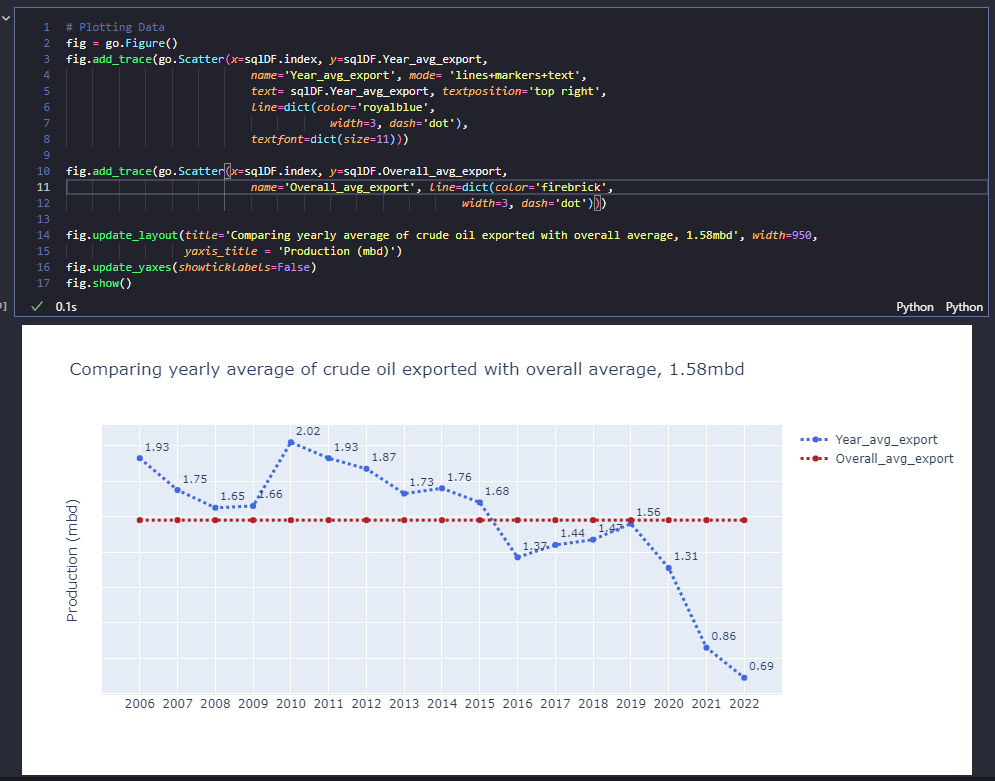
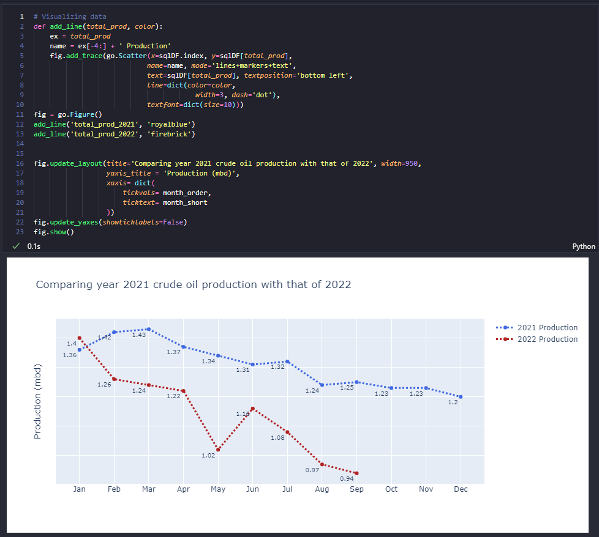

# Nigeria Crude Oil Analysis
## By Goodrich Okoro
## [View Project](https://nbviewer.org/github/TelRich/Crude_Oil_Analysis_With_SQL/blob/main/Crude_oil_analysis.ipynb?flush_cache=True)

# Nigeria Export Crude Oil Production and Price

According to [Wikipedia](https://en.wikipedia.org/wiki/Petroleum_industry_in_Nigeria#:~:text=Nigeria%20is%20the%20largest%20oil,paraffinic%20and%20low%20in%20sulfur.), Nigeria is the largest oil and gas producer in Africa. [Crude oil](https://en.wikipedia.org/wiki/Petroleum) from the [Niger delta basin](https://en.wikipedia.org/wiki/Niger_Delta) comes in two types: [light](https://en.wikipedia.org/wiki/Light_crude_oil), and comparatively [heavy](https://en.wikipedia.org/wiki/Heavy_crude_oil) – the lighter has around 36 gravity while the heavier has 20–25 gravity. Both types are [paraffinic](https://en.wikipedia.org/wiki/Alkane) and low in [sulfur](https://en.wikipedia.org/wiki/Sulfur).Nigeria's economy and budget have been largely supported from income and revenues generated from the petroleum industry since 1960. Statistics as at February 2021 shows that the Nigerian oil sector contributes to about 9% of the entire [GDP](https://en.wikipedia.org/wiki/Gross_domestic_product) of the nation. Nigeria is the largest oil and gas producer in Africa, a major exporter of crude oil and petroleum products to the United States of America. In 2010, Nigeria exported over one million barrels per day to the United States of America, representing 9% of the U.S. total crude oil and petroleum products imports and over 40% of Nigeria exports.

This project involves the use of [**SQL**](https://www.w3schools.com/sql/) and [**Python**](https://www.python.org/) programming language. SQL will be used to answer the given question while Python will be used to present the answers as a dataframe and visualize it where necessary.

The data used for this analysis can be found on [Central Bank of Nigeria (CBN) Statistic section](https://www.cbn.gov.ng/rates/crudeoil.asp). It contain 5 fields with 201 records.

<h1 id="crude_oil"><code>CrudeOilPrice</code></h1>
<table>
<thead>
<tr>
<th>column</th>
<th>type</th>
<th>description</th>
</tr>
</thead>
<tbody>
<tr>
<td><code>year</code></td>
<td><code>varchar</code></td>
<td>Year of production</td>
</tr>
<tr>
<td><code>month</code></td>
<td><code>smallint</code></td>
<td>Month in each year</td>
</tr>
<tr>
<td><code>crude_oil_price</code></td>
<td><code>decimal</code></td>
<td>Price of crude oil (US$/Barrel)</td>
</tr>
<tr>
<td><code>production</code></td>
<td><code>decimal</code></td>
<td>Crude oil produced in millions barrels per day (mbd)</td>
</tr>
<tr>
<td><code>crude_oil_export</code></td>
<td><code>decimal</code></td>
<td>Crude oil exported in millions barrels per day (mbd)</td>
</tr>
</tbody>
</table>

## Summary
* Average price of crude oil increases as the year begins and decrease as the year comes to an end.
* Crude oil price is has been inreasing since 2020, currently (2022) the minimum price per barrel is $88.71 compare to the maximum price of $66.68 in year 2020.
* There has been a decrease in oil production since year 2019. 
* According to [Vanguard news](https://www.vanguardngr.com/2022/04/nigerias-oil-production-rises-5-07-to-1-388mbd-in-q1/) published on April 19, 2022. Nigeria’s failure to boost crude oil production in the face of high price of oil in the international market has been largely blamed on high oil theft and pipeline vandalism in the Niger Delta region. 
* The Group Managing Director of the Nigerian National Petroleum Corporation (NNPC) Limited, Mallam Mele Kyari revealed earlier in April that oil production has crashed to 1.15 million barrels per day. According to him, “As we speak now, there is massive disruption to our operations as a result of the activities of vandals and criminals along our pipelines in the Niger Delta area. This has brought down our production to levels as low as we have never seen before. [Article](https://www.vanguardngr.com/2022/04/nigerias-oil-production-rises-5-07-to-1-388mbd-in-q1/)
* Starting from 2016, the yearly average of crude oil exported has not pass the overall average of crude oil exported.
* The percentage decrease of oil exported in each month of year 2022 compared to months in 2021 is currently above 14%, except for January where ther was 4% increase in exported crude oil.  
* For this sample of data, there is a perfect linear relationship between production and crude oil exported.

## Limitations
* The Dataset consist of few records which starts from 2006 to 2022, this may affects our general view of oil production.
* Our data has few features which is not sufficient enough to depict why there is a fall in oil production.
* Samples for year 2022 is not complete, it stops at september.
* This data did not meet the rule of thumb where at least 100 samples is required for each feature before proceeding to building an algorithm for prediction.
